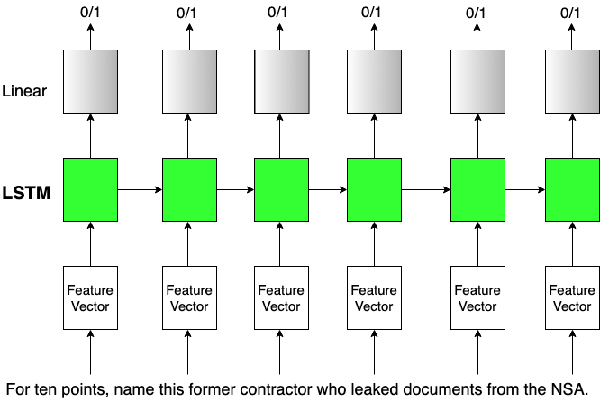

Sequence Buzzer
=

Due: 29 March 2019 (23:55)

Overview
--------

The figure is a cartoon representation - a rough visualization to give an idea of what is going on with the sequence buzzer. The aim is to code a RNN based buzzer, which can output a 0/1 decision whether to buzz or not at every timestep. The timestep can be every word, or every few characters (the latter is chosen in this homework - controlled using 'char_skip'). At every such time step, the text of the question seen so far is represented as a feature vector. In this homework, we simply use the probabilities or scores associated with the top n guesses of a tfidf guesser as feature vector (but you can imagine using more and better features like word embeddings, etc. for your projects). Then an RNN/LSTM predicts if system should buzz (1) or not (0) for each timestep. The gold labels for this comes from comparing the top guess of the guesser for the question text seen up to the timestep, and the actual answer to the full question.

A significant difference you will observe for a sequence classifier from something like a DAN (in previous homework) is having to deal with different lengths of not just the input, but also the output since _we have a label at every time step_. This requires padding the sequences to make the same length as the maximum length in the batch, and then making use of 'masking' when computing loss to carefully ignore the padded labels and corresponding predictions/logits. We define a custom loss function (loss_fn) and accuracy function (accuracy_fn) to handle the computation for masked predictions.

You have to complete **buzzer.py**. There is a supporting file 'dataset_util.py' and it might be useful to go through it as well. A significant part of this assignment is to go through all the various functions and gain an understanding of how everything is working. The code you have to write is indicated via comments. Comments in the code also contain some examples for explanation.

You'll turn in your code on the submit server. This assignment is worth 50 points.

What you have to do
----------------

Coding: (45 points)
1. Understand the structure of the code.
2. Complete the **create_feature_vecs_and_labels** function.
3. Complete the **RNNBuzzer model init**ialization. 
4. Write the **RNNBuzzer model forward** function.
5. Complete the **train** function, making use of the custom defined loss and accuracy functions.
6. Complete the **evaluate** function, again making using of the accuracy_fn.

Analysis: (5 points)
1. Report the final epoch dev set accuracy (post some potential tuning as per your choice). Please indicate all the values of the various hyperparameters that go with this reported score including number of epochs (these are hyperparameters that can have an effect on accuracy in theory - please think about and mention ALL the things you think can be changed, as a way to understand what things you control when designing a sequence to sequence neural net).
2. Report the final test set accuracy after tuning on dev set.
3. Look at the dev set, give some examples and explain the possible reasons why these examples are predicted incorrectly - in particular, why do you think a model did not buzz (predicted 0) when actually it should have buzzed, and vice-versa.

ProTips
----------------

1. The inital run of the code *will* take time - at least 10-15 minutes and possibly upto 30 minutes. BUT both the trained guesser models and the training/dev/test data files for buzzer to train and act on will be saved, and you can (and probably should) simply run your code afterwards as python buzzer.py --guesser_saved_flag=True --buzz_data_saved_flag=True.

2. Take a look at dataset_util.py - it will help understand how each question object is structured, and especially the useful functionality called 'runs' which allows splitting up a question into multiple partial snippets.

3. 'Flattening' is a loose term for going from \[\[1,2\],\[3,4\], \[5,1\]\] -> \[1, 2, 3, 4, 5, 1\] while 'Deflattening' is a loose term for going in the opposite direction.

---more could be added----

Extra Credit
----------------
(Please code extra credit part separately, not for submission to submit server) For extra credit, try and do two things - 

1. Create a feature vector that uses pre-trained word embeddings. One way to do this is to take the word embeddings of all words of the question text seen so far and average them (creating a 300 dimensional (for example) feature vector at every time step instead of the 10-dimensional probability vector we have in the normal version). Describe how you incorporated word embeddings in your feature vector and what effect it had on the performance (compared to the feature vector given already) in a separate section of your *analysis.pdf*.
2. Submit your system (guesser + buzzer) to Codalab.

What to turn in 
----------------

1. Submit your a **buzzer.py** file
2. Submit your **analysis.pdf** file 

    No more than one page 
    
    Include your name at the top of the pdf
